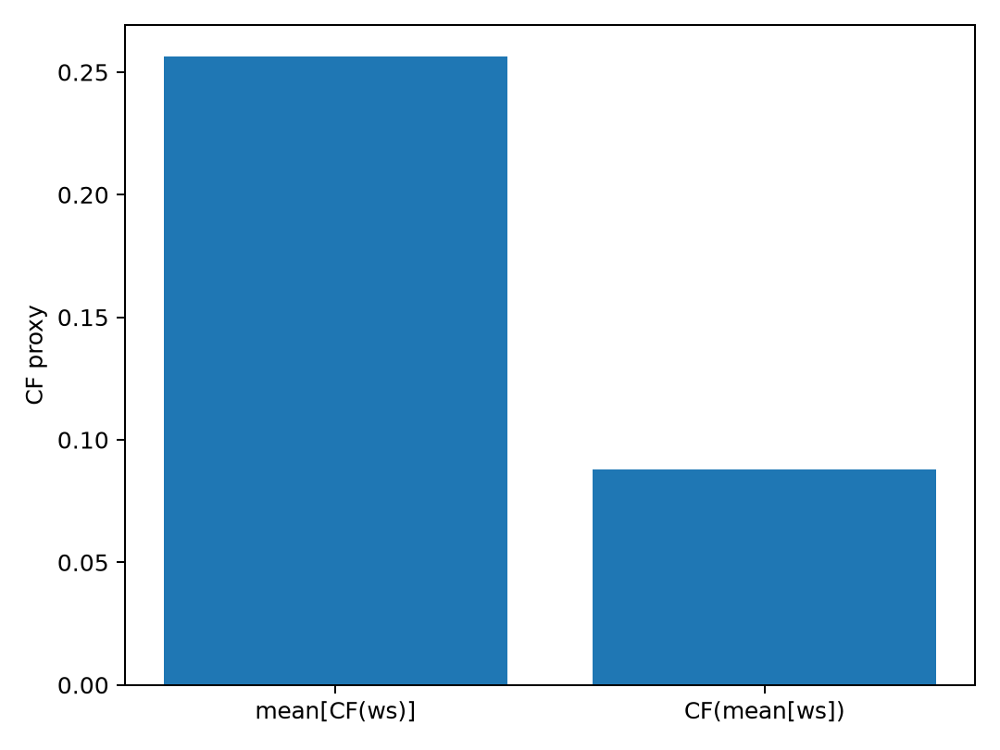
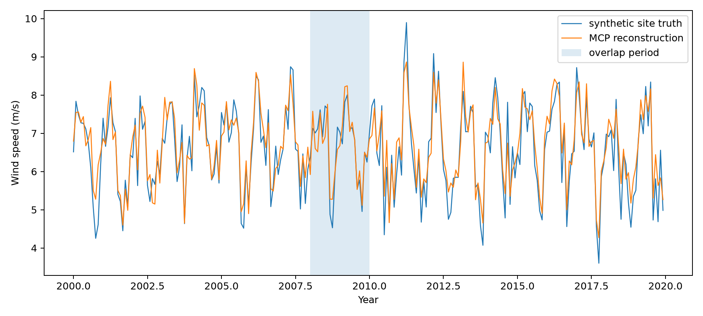
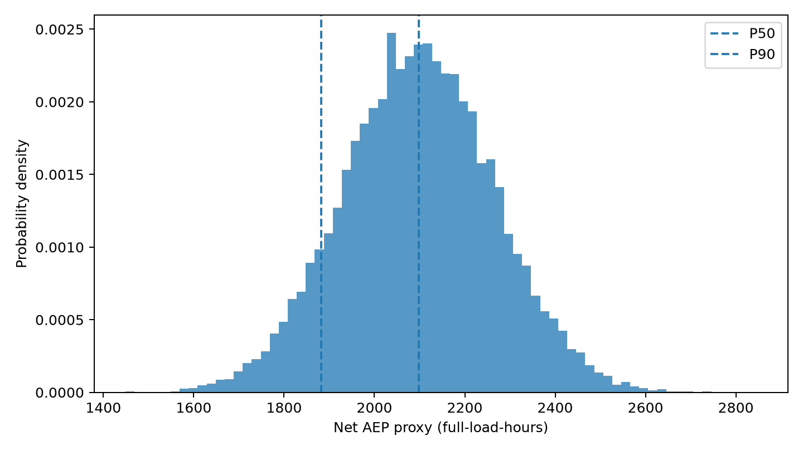
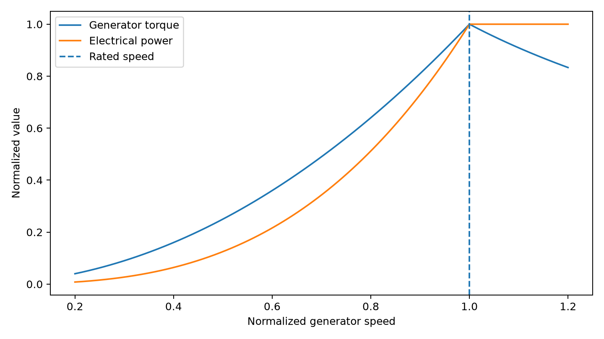

# 计算示例

目录内包含五个可运行Notebook，均使用合成数据，重点检查正文中的计算关系、变量定义和适用边界。

当前包括：

1. `01_wind_distribution_to_power.ipynb`  
   比较平均风速接近、分布形状不同的两组风速经过同一功率曲线后的平均出力。

2. `02_vector_mean_and_aggregation.ipynb`  
   比较平均风矢量模长与平均标量风速，并检查空间聚合与非线性功率映射的先后顺序。

3. `03_mcp_long_term_reference.ipynb`  
   用合成数据演示MCP长期订正，以及重叠时段长度对拟合结果的影响。

4. `04_uncertainty_propagation.ipynb`  
   用Monte Carlo抽样把风速尺度、尾流损失、可利用率和电气损失传播到Net AEP代理分布，并计算P50/P90。

5. `05_turbine_control_regions.ipynb`  
   用归一化变量展示额定以下转矩控制、额定以上功率限制和变桨之间的关系。

这些Notebook使用`numpy`和`matplotlib`，依赖见`requirements.txt`。示例结果用于检查概念和计算顺序，不产生可用于项目开发的AEP、P50或P90。工程方法和来源见正文与`08_library`。

## 图形预览

风速分布差异：

非线性聚合顺序：

MCP长期订正：

不确定性传播：

风机控制工作区：

其余静态图位于`figures/`，可用`render_figures.py`重新生成。
