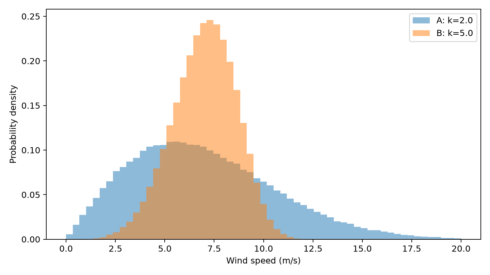

# Wind Energy Notes｜风电与风资源研究导览

围绕风资源评估、气象数据、多尺度数值模拟、风电能量评估和气候应用整理的一组研究笔记。内容按问题链组织，基础事实优先来自官方文档、同行评议论文和长期维护的开源项目。

当前内容覆盖从风况描述到年发电量（Annual Energy Production, AEP）与不确定性的工程链，也保留一个CanESM5—ERA5风场精细化案例，用于讨论气候模式精细化中的参考恢复、状态保持和下游风电指标传导。

## 研究链条

```text
大气运动
  ↓
风场与风资源
  ↓
测量 / 再分析 / 数值模拟 / 气候模式
  ↓
长期订正 / 高度转换 / 空间局地化
  ↓
风机功率与风电场效应
  ↓
发电机 / 变流器 / 并网控制
  ↓
Gross / Net AEP 与不确定性
  ↓
风险与电力系统应用
```

在这条链里，风速描述气象状态，功率表示某一时刻或时间段内的能量转换速率，发电量是功率随时间的累计；容量因子（Capacity Factor, CF）再把实际发电量与额定功率持续运行时的理论最大发电量进行比较。

## 研究主题

| 线索 | 关注内容 | 入口 |
|---|---|---|
| 风资源评估 | 测量、长期代表性、MCP长期订正、边界层、稳定度与空间外推 | [从风到风资源](02_wind_resource/01_from_wind_to_resource.md) · [长期代表性](02_wind_resource/02_variability_and_measurement.md) · [评估链条](02_wind_resource/03_assessment_workflow.md) · [ABL/稳定度/湍流](02_wind_resource/04_boundary_layer_stability_turbulence.md) |
| 风到电 | 功率曲线、CF、AEP、不确定性、风机控制、电力电子与SCADA | [功率曲线与CF](03_wind_to_power/01_power_curve_and_capacity_factor.md) · [AEP与不确定性](03_wind_to_power/02_energy_yield_and_uncertainty.md) · [不确定性传播](03_wind_to_power/03_uncertainty_propagation.md) · [风机控制与电力电子](03_wind_to_power/04_turbine_control_power_electronics.md) · [SCADA运行监测](03_wind_to_power/05_scada_operation_monitoring.md) |
| 多尺度气象 | ERA5、气候模式、WRF、CFD、复杂地形与尾流 | [观测/再分析/气候模式](04_data_and_models/01_measurement_reanalysis_climate_models.md) · [WRF与CFD](04_data_and_models/02_wrf_and_cfd.md) · [复杂地形与尾流](04_data_and_models/03_complex_terrain_and_wakes.md) |
| 数据驱动与气候应用 | 降尺度、AI精细化、未来迁移与评价边界 | [降尺度与AI](05_methods/01_downscaling_and_ai.md) · [CanESM5—ERA5案例](06_case_study/01_canesm5_era5_balanced_refinement.md) |
| 硕士课题主线 | WRF、多源数据融合、CFD耦合、AI风资源评估与复杂地形应用 | [课题系统展开](10_master_topic/01_wrf_multisource_cfd_ai_wind_resource.md) |

## 目录

| 目录 | 内容 |
|---|---|
| [01_landscape](01_landscape/01_research_landscape.md) | 风电研究领域与尺度概览 |
| [02_wind_resource](02_wind_resource/01_from_wind_to_resource.md) | 风资源、测量、长期订正、ABL与稳定度 |
| [03_wind_to_power](03_wind_to_power/01_power_curve_and_capacity_factor.md) | 功率曲线、AEP、控制、并网与SCADA运行监测 |
| [04_data_and_models](04_data_and_models/01_measurement_reanalysis_climate_models.md) | ERA5、气候模式、WRF、CFD、复杂地形与尾流 |
| [05_methods](05_methods/01_downscaling_and_ai.md) | 降尺度、精细化与AI方法 |
| [06_case_study](06_case_study/01_canesm5_era5_balanced_refinement.md) | CanESM5—ERA5风场精细化案例 |
| [07_resources](07_resources/README.md) | 官方资料、论文与开源项目索引 |
| [08_library](08_library/README.md) | 论文、技术报告与来源追溯资料库 |
| [09_notebooks](09_notebooks/README.md) | 计算示例与静态图 |
| [10_master_topic](10_master_topic/01_wrf_multisource_cfd_ai_wind_resource.md) | WRF—多源融合—CFD—AI风资源评估课题主线 |

## 计算示例

平均风速接近的两组风况，在分布形状不同的情况下可以产生明显不同的平均功率响应：



对应Notebook见[风速分布与功率曲线](09_notebooks/01_wind_distribution_to_power.ipynb)。其余示例包括风矢量平均、非线性聚合顺序、MCP长期订正、[Monte Carlo不确定性传播](09_notebooks/04_uncertainty_propagation.ipynb)和[风机控制工作区](09_notebooks/05_turbine_control_regions.ipynb)。

## 来源与边界

关键来源与核验记录见[SOURCES.md](SOURCES.md)，已归档的论文和技术资料见[08_library](08_library/README.md)。社区项目用于补充工作流和工程实践，不承担正式定义的来源角色。

`06_case_study`来自当前CanESM5—ERA5风场精细化重跑结果。未来SSP585部分只描述结构迁移，不提供未来准确度验证；月平均近地层`u,v`得到的CF只作为代理指标使用。

---
Last reviewed: 2026-09-18
